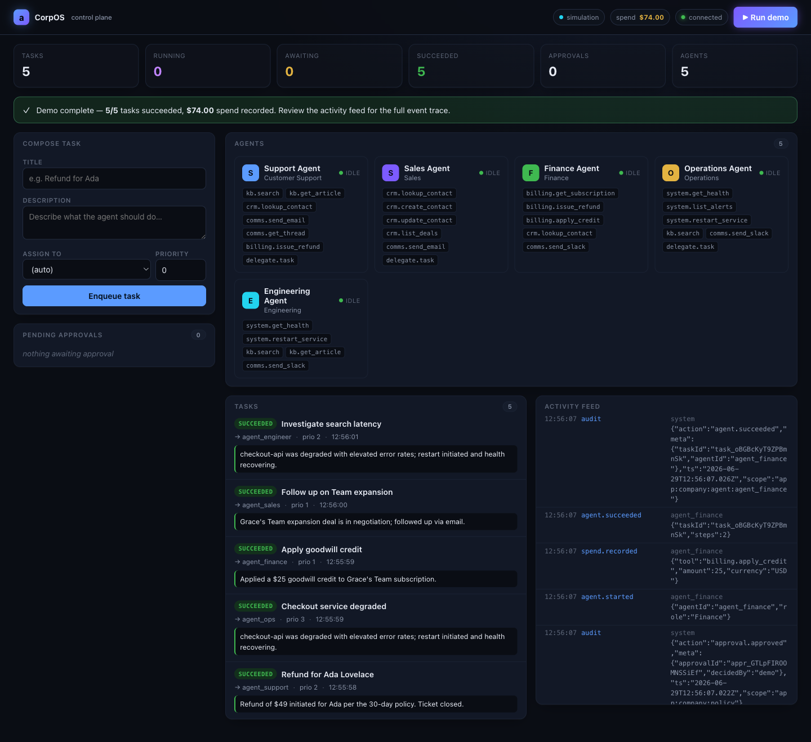

# CorpOS

> A reference architecture for an autonomous company — a TypeScript multi-agent runtime with a policy, approval, and audit control plane.

[](https://github.com/SafetyMP/CorpOS/actions/workflows/ci.yml)
[](LICENSE)
[](package.json)
[](test)

<p align="center">
  
</p>

CorpOS is a **greenfield, architecture-first** system: a clean, layered design for running an organization of LLM-driven agents where **every consequential action is policy-gated**. Department agents (support, sales, ops, finance, engineering) reason via an LLM, call permissioned tools, and coordinate through a shared orchestrator. Spend, external comms, and mutations never run autonomously — they route through an approval engine and produce audit events.

It's built **simulation-first**: the entire multi-agent loop, tool-calling, approval gates, spend tracking, and dashboard are fully demonstrable and tested with **no LLM key and no network**. Drop in an OpenRouter key to switch the agents to live reasoning.

---

## Design principles

CorpOS is built as an open reference architecture, not a black box. The decisions that shape it:

- **Architecture over implementation.** The value lives in the layers — a typed runtime, a permissioned tool registry, a policy chokepoint, and a control plane — not in any one agent or integration.
- **Policy as the single chokepoint.** There is exactly one place a consequential action is authorized. Tools can't bypass it; agents can't bypass it. Auditability is a side-effect of the design, not a feature bolted on.
- **Simulation-first = reproducible.** The reasoning loop is LLM-driven but fully deterministic under the `SimulationProvider`. The whole system builds and tests in CI with zero network and zero cost.
- **Human-in-the-loop by default.** Consequential actions pause for approval. Agents resume from the exact conversation state where they paused — no lost context, no re-prompting.
- **Boring, durable tech.** TypeScript, SQLite, Express, vanilla web. No agent framework lock-in; every primitive is readable in a single file.

## Architecture

```
┌─────────────────────────── Control plane (src/api) ───────────────────────────┐
│  Express REST (tasks, agents, approvals, spend, events) · WebSocket · dashboard │
└──────────────────────────────────────┬────────────────────────────────────────┘
                                       │
┌─────────────────────────────── Orchestrator (src/core) ───────────────────────┐
│  lifecycle · dispatch · concurrency · retries · approval resume                │
└──────────────────────────────────────┬────────────────────────────────────────┘
                                       │
            ┌──────────────────────────┼───────────────────────────┐
            ▼                          ▼                           ▼
       Agent (loop)              Policy engine                Tool registry
   reason → tool → observe      allow / deny / approve       typed, JSON-schema,
   pause/resume on gates        spend caps, approvals         permission-gated
            │                          │                           │
            └────────────── LLM provider ──────────── Store (SQLite) ─┘
                  Simulation (default)         tasks · events · approvals
                  OpenRouter / Z.AI / OpenAI   spend · memory · audit
```

| Layer             | Path                         | Responsibility                                                                                                        |
| ----------------- | ---------------------------- | --------------------------------------------------------------------------------------------------------------------- |
| **Runtime**       | `src/core/`                  | types, llm, logger(+audit), event-bus, store (SQLite), tool registry, policy engine, memory, agent loop, orchestrator |
| **Agents**        | `src/agents/`                | one file per department — system prompt + tool subset                                                                 |
| **Tools**         | `src/tools/`                 | CRM, comms, billing, knowledge, system packs over shared seeded state + agent-to-agent delegate                       |
| **Control plane** | `src/api/`, `src/dashboard/` | Express REST + WebSocket + static dashboard                                                                           |

## Quick start

```bash
git clone https://github.com/SafetyMP/CorpOS.git
cd CorpOS
npm install
npm run dev        # boot the server + dashboard on $PORT or 3000
```

Open `http://localhost:3000/`. With no key set, agents run in **simulation** — click **▶ Run demo** to watch a curated 5-agent scenario auto-play through real approval gates.

> **Node version:** requires Node 20+ (verified through Node 26). If `npm install`
> fails while compiling `better-sqlite3` (a V8-API error from node-gyp), you're on
> an unsupported Node — use Node 22 LTS. On supported versions the install uses a
> prebuilt binary, so no compiler is needed.

### Live demo (one-click deploy)

No clone required — run the control plane in the cloud in simulation mode, then
click **▶ Run demo**:

[](https://render.com/deploy?repo=https://github.com/SafetyMP/CorpOS)

Prefer Fly.io? It's one command (uses the published image):

```bash
flyctl launch --image ghcr.io/safetymp/corpos:0.1.0
```

Set `OPENROUTER_API_KEY` in either dashboard to switch the agents from
simulation to live reasoning. See [Deployment](#deployment) below.

### Go live (OpenRouter / Owl Alpha)

```bash
cp .env.example .env
# edit .env:
#   OPENROUTER_API_KEY=sk-or-...
#   OPENROUTER_MODEL=<your Owl Alpha slug>
npm run dev
```

The header badge flips from `simulation` to `live · openrouter`, and agents reason against the real model. Z.AI and OpenAI are also supported (auto-detected by key).

## Demo mode

One click on **▶ Run demo** posts a curated 5-agent scenario — support refund, ops service restart, finance goodwill credit, sales follow-up, engineer diagnosis — and **auto-resolves every approval gate** so the full policy-gated loop plays out without manual steps. Deterministic in simulation; genuine reasoning when live.

## How an action gets approved

1. A task is enqueued; the orchestrator assigns it to an agent.
2. The agent reasons and emits tool calls. Each call is evaluated by the **policy engine**.
3. A `read` call runs; a `spend` / `communicate` / mutating call **pauses** and creates a pending approval.
4. A human approves via the dashboard or `POST /api/approvals/:id/decide`.
5. On approval the agent **resumes from where it paused** (conversation preserved), executes the action, records spend, and produces a final summary — all audited.

## Commands

| Command             | What it does                                      |
| ------------------- | ------------------------------------------------- |
| `npm install`       | Install dependencies                              |
| `npm run dev`       | Boot API + dashboard (tsx watch)                  |
| `npm run scenario`  | Run a recorded deterministic multi-agent scenario |
| `npm test`          | Run the vitest suite (deterministic, no network)  |
| `npm run typecheck` | `tsc --noEmit`                                    |
| `npm run build`     | Compile to `dist/`                                |

## REST + WebSocket API (selected)

| Method         | Path                        | Purpose                                 |
| -------------- | --------------------------- | --------------------------------------- |
| `GET`          | `/api/health`               | Liveness + provider mode                |
| `GET`          | `/api/agents`               | Registered agents + tools               |
| `GET` / `POST` | `/api/tasks`                | List / submit tasks                     |
| `GET`          | `/api/approvals`            | Pending approvals                       |
| `POST`         | `/api/approvals/:id/decide` | `{decision:"approved"\|"rejected", by}` |
| `GET`          | `/api/spend`                | Spend ledger totals                     |
| `GET`          | `/api/events?limit=50`      | Recent events                           |
| `WS`           | `/ws`                       | Live snapshot + event stream            |

```bash
curl -X POST http://localhost:3000/api/tasks \
  -H 'content-type: application/json' \
  -d '{"title":"Refund for Ada","description":"ada@example.com wants a $49 refund on sub_ada_pro.","assignedTo":"agent_support","priority":2}'
```

## Configuration

Environment variables (auto-loaded from `.env` on boot — see `.env.example`):

| Var                                       | Default                | Purpose                                       |
| ----------------------------------------- | ---------------------- | --------------------------------------------- |
| `OPENROUTER_API_KEY`                      | —                      | Live OpenRouter key. Unset → simulation mode. |
| `OPENROUTER_MODEL`                        | `openrouter/owl-alpha` | Model slug.                                   |
| `OPENROUTER_REFERER` / `OPENROUTER_TITLE` | —                      | OpenRouter attribution headers.               |
| `OPENAI_API_KEY` / `ZAI_API_KEY`          | —                      | Alternative providers (auto-detected).        |
| `PORT`                                    | `3000`                 | HTTP port.                                    |
| `LOG_LEVEL`                               | `info`                 | `debug` / `info` / `warn` / `error`.          |

Never commit a real `.env` (it's gitignored).

## Project structure

```
src/
  core/         runtime: types, llm, store, tool, policy, memory, agent, orchestrator, app
  agents/       department agents (support, sales, finance, ops, engineer)
  tools/        tool packs (crm, comms, billing, knowledge, system, delegate) + seeded state
  api/          Express REST + WebSocket server
  dashboard/    static dashboard (single-file HTML/CSS/JS)
  index.ts      composition root — wires core + agents + tools + server, loads .env
  scenario.ts   deterministic multi-agent demo
test/           vitest unit + e2e (deterministic via SimulationProvider)
.github/        CI workflow
docs/           screenshots / assets
```

## Tech stack

TypeScript (ESM, strict) · Node ≥ 20 · better-sqlite3 · Express · ws · zod · nanoid · vitest · tsx. The dashboard is dependency-free vanilla HTML/CSS/JS.

## Deployment

A prebuilt multi-arch image is published to the GitHub Container Registry on
every push to `main` and every release:

```bash
docker run --rm -p 3000:3000 ghcr.io/safetymp/corpos:latest
# → http://localhost:3000  (simulation mode, zero config)
```

Go live by passing a key:

```bash
docker run --rm -p 3000:3000 \
  -e OPENROUTER_API_KEY=sk-or-... \
  -e OPENROUTER_MODEL=<your Owl Alpha slug> \
  ghcr.io/safetymp/corpos:latest
```

Managed options (both auto-detect the `Dockerfile`, both run the simulation
demo by default):

- **Render** — one click via the "Deploy to Render" button above; configured by
  [`render.yaml`](render.yaml).
- **Fly.io** — `flyctl launch --image ghcr.io/safetymp/corpos:0.1.0`; configured
  by [`fly.toml`](fly.toml), with a release-triggered
  [deploy workflow](.github/workflows/deploy.yml) (needs `FLY_API_TOKEN`).

⚠️ **Do not deploy to a public URL without reading [SECURITY.md](SECURITY.md)
first** — the control plane has no authentication, and anyone who can reach it
can approve gated actions. For a public demo, keep it in simulation mode and
restart it periodically (SQLite state at `data/company.db` persists across restarts unless the volume is cleared).

## Security

CorpOS is a **reference architecture and research/demo project, not production-hardened.** Consequential actions are policy-gated by design, but the control plane has no authentication by default — optional `DASHBOARD_API_TOKEN` gates approval mutations. Do not expose it to untrusted networks. See [SECURITY.md](SECURITY.md) for the full posture and vulnerability reporting.

## Contributing

Contributions are welcome. The codebase is intentionally readable and layered — each core primitive fits in a single file. See [AGENTS.md](AGENTS.md) for the engineering rules and conventions the project follows (commit style, verification, code style) and [CONTEXT.md](CONTEXT.md) for architecture orientation. Run `npm test` before opening a PR; CI enforces typecheck + tests.

## License

Apache License 2.0 — see [LICENSE](LICENSE) and [NOTICE](NOTICE). Copyright © 2026 SafetyMP.
