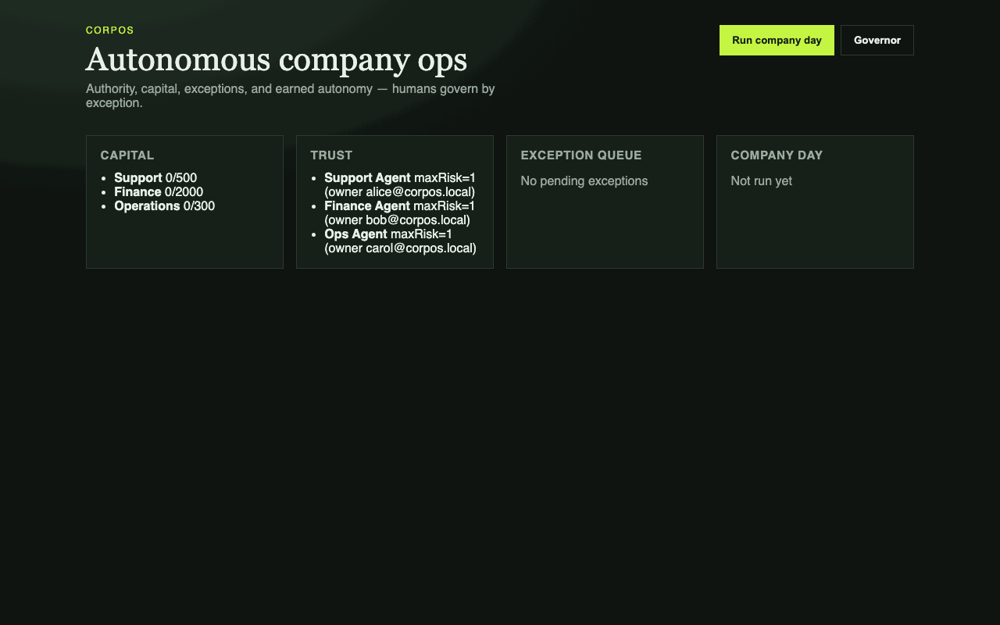
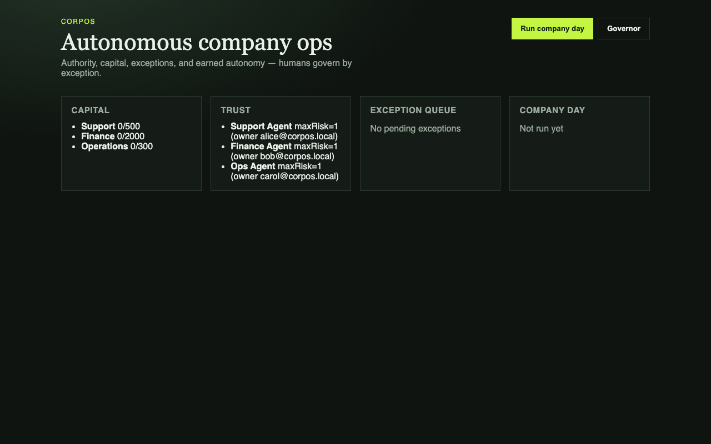
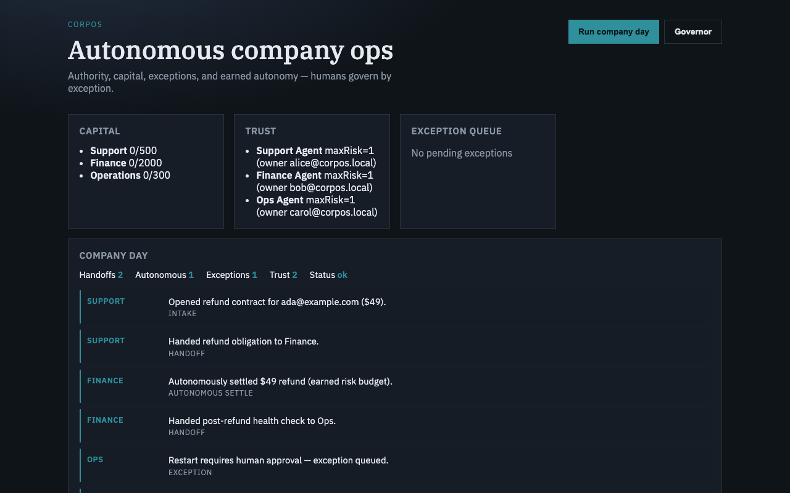
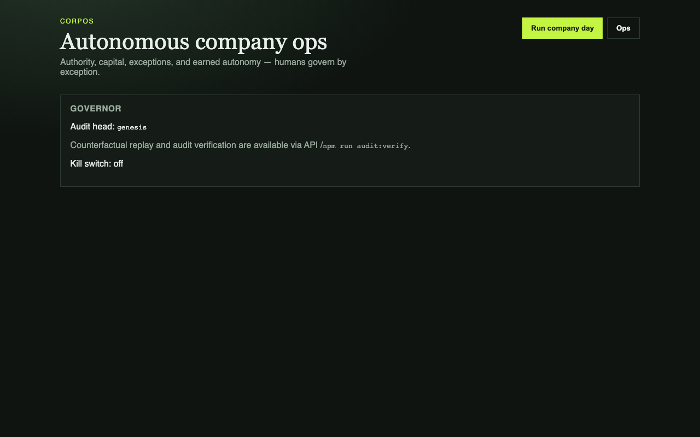

# CorpOS

> Reference implementation of an **autonomous company** — firm model, work contracts, policy-gated control plane, and a July 2026 **governance plane** (PDP/PEP, three-layer authz, OTel GenAI, OWASP ASI / NIST RMF crosswalk).

[](https://github.com/SafetyMP/CorpOS/actions/workflows/ci.yml)
[](https://github.com/SafetyMP/CorpOS/actions/workflows/codeql.yml)
[](https://scorecard.dev/viewer/?uri=github.com/SafetyMP/CorpOS)
[](LICENSE)
[](#quick-start)

CorpOS shows how a firm operates when department agents do most work and **humans govern by exception** (Approve / Reject / Kill in the ops console). Autonomy is earned from evidence, not granted in prompts. Interop protocols (MCP) are transport; **community governance (G1–G6)** lives in the firm.

> **Scope:** Reference architecture and runnable demo — **not** a production-hardened SaaS. See [SECURITY.md](SECURITY.md).

Default mode is **simulation** (`SimulationProvider`) for deterministic CI. Live LLM (`HttpLLMProvider`) only when `CORPOS_ALLOW_LIVE=1` and `OPENROUTER_API_KEY` are set — `/api/health.mode` never lies.

Read the thesis: [`docs/future-of-the-firm.md`](docs/future-of-the-firm.md). Governance crosswalk: [`docs/governance-crosswalk.md`](docs/governance-crosswalk.md). AIBOM: [`docs/aibom.json`](docs/aibom.json).

**Jump to:** [Demo](#demo) · [Quick start](#quick-start) · [Architecture](#architecture) · [Contributing](CONTRIBUTING.md) · [Security](SECURITY.md) · [ADRs](docs/adr/)

---

## Demo

<p align="center">
  
</p>

### Screenshots

|             Ops             |               Company day               |               Governor                |
| :-------------------------: | :-------------------------------------: | :-----------------------------------: |
|  |  |  |

- **Local demo:** `npm install && npm run build && npm run dev` → [http://localhost:3000](http://localhost:3000)
- **Regenerate GIF/PNGs:** start the console, then `npm run screenshots` — see [`docs/assets/README.md`](docs/assets/README.md)

Click **Run company day** to watch the agent activity timeline: support → finance → ops handoffs, an autonomous settle, an exception approval path, compensation, and trust unlock.

---

## Quick start

```bash
npm install
npm run build
npm run dev        # ops console on $PORT or 3000
```

```bash
npm test
npm run scenario
npm run audit:verify
./scripts/harness/verify.sh
```

## Architecture

| Layer                 | Package / app           | Responsibility                                        |
| --------------------- | ----------------------- | ----------------------------------------------------- |
| Firm / work / control | `@corpos/core`          | Contracts, gateway, policy, trust, audit, company day |
| MCP knowledge         | `@corpos/mcp-knowledge` | Real local MCP server (stdio)                         |
| API                   | `@corpos/api`           | Hono REST + SSE                                       |
| Ops console           | `@corpos/console`       | Vite + Preact                                         |

Stack: Node ≥22 · TypeScript · npm workspaces · Hono · Drizzle + libsql · official MCP SDK · Preact. No Express, no `better-sqlite3`, no agent-framework lock-in.

Architecture decisions live in [`docs/adr/`](docs/adr/).

## Security

Reference architecture — not production-hardened. Set `CORPOS_MODE=shared` and `DASHBOARD_API_TOKEN` before exposing approvals. See [SECURITY.md](SECURITY.md).

## Community

[Contributing](CONTRIBUTING.md) · [Code of Conduct](CODE_OF_CONDUCT.md) · [Security](SECURITY.md) · [ADRs](docs/adr/)

## License

Apache-2.0 — Copyright © 2026 SafetyMP.
